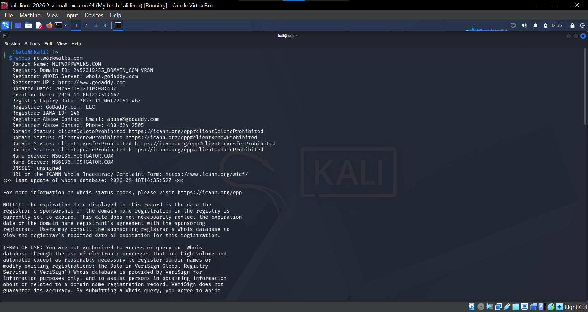

# Footprinting-Reconnaissance-and-Network-Scanning
A hands-on cybersecurity lab documenting footprinting, reconnaissance, information gathering, and local network scanning using Kali Linux, Nmap/Zenmap, and other reconnaissance tools week2 project with Networkwalks

**Overview**

This repository documents my hands-on cybersecurity practical on footprinting, reconnaissance, information gathering, and network scanning.

The practical started with gathering information about a Networkwalks.com using different reconnaissance tools in Kali Linux. I then moved to network scanning using Zenmap/Nmap to identify live hosts on my local subnet and collect information such as IP addresses and MAC addresses.

This project helped me understand how reconnaissance and scanning are used during the early stages of a cybersecurity assessment.


**Objectives**

The main objectives of this practical were to:

* Understand the concept of footprinting and reconnaissance.
* Gather information about a target using different reconnaissance tools.
* Understand how WHOIS information can be collected.
* Identify technologies and information associated with a website.
* Examine DNS information.
* Check HTTP response headers.
* Identify possible web application firewalls.
* Perform network discovery using Zenmap.
* Identify live hosts on a local subnet.
* Identify the IP addresses and MAC addresses of live hosts.
* Generate and save a network topology.


## Part 1 — Footprinting and Reconnaissance

**What is Footprinting and Reconnaissance**?

Footprinting and reconnaissance are information-gathering activities carried out during the early stages of a cybersecurity assessment.

The purpose is to collect useful information about a target before moving to other security testing activities.

During this practical, I used several tools to gather different types of information.


**Tools Used**

## 1. WHOIS

WHOIS was used to retrieve publicly available registration information associated with a domain,networkwalks.com.

I ran the WHOIS command from my Kali Linux terminal and saved the output for documentation and later use in my report.
Command used:
 ```bash
whois networkwalks.com
```

**What I found**
From the WHOIS results, I was able to gather information such as:

* Domain name
* Domain registration and expiry dates
* Registrar information
* Domain status
* Name servers
* Other publicly available registration details.

**Evidence**  

###WHOIS Result



