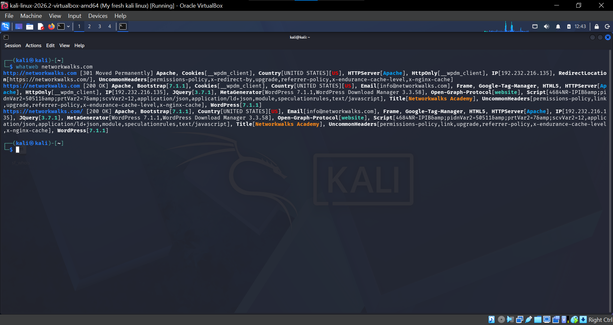
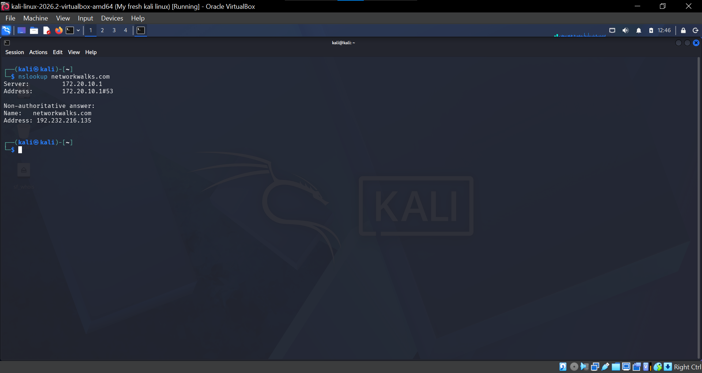
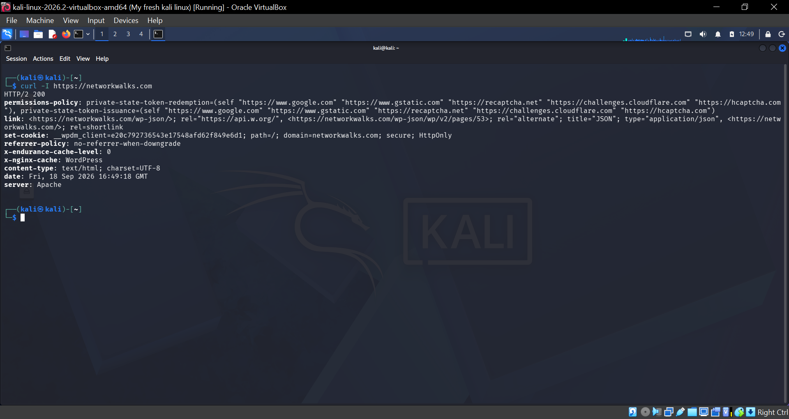
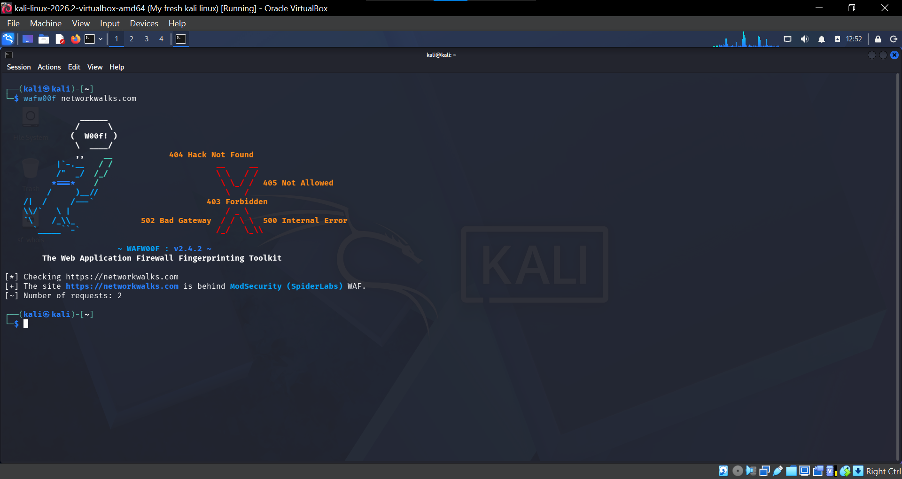
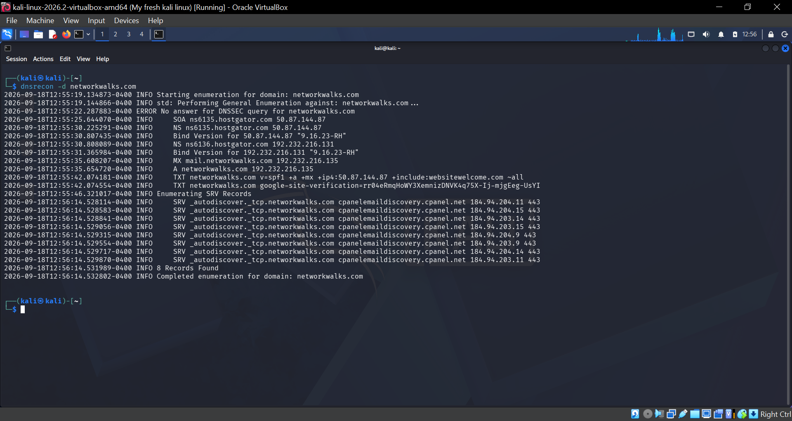
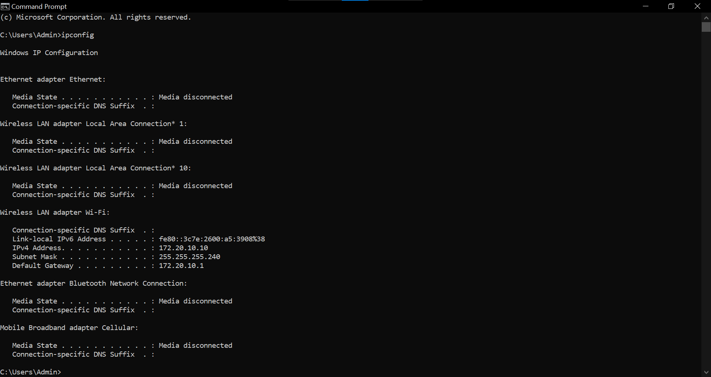
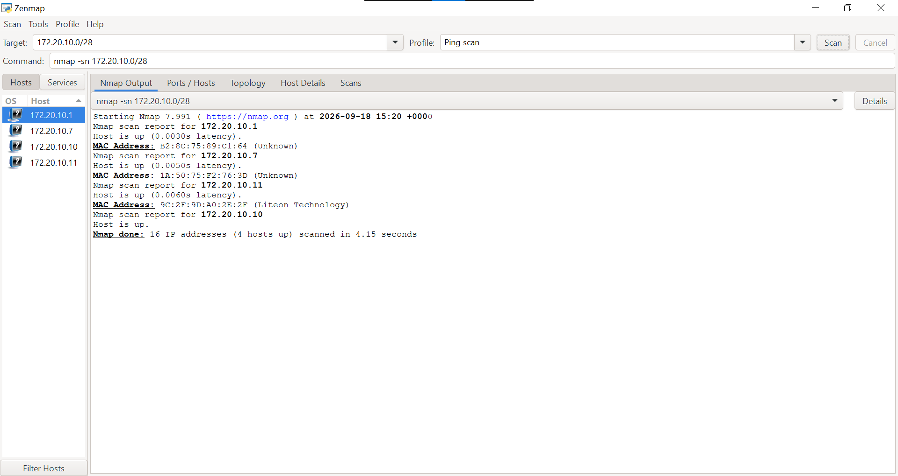

# Footprinting-Reconnaissance-and-Network-Scanning
A hands-on cybersecurity lab documenting footprinting, reconnaissance, information gathering, and local network scanning using Kali Linux, Nmap/Zenmap, and other reconnaissance tools week2 project with Networkwalks

## Overview

This repository documents my hands-on cybersecurity practical on footprinting, reconnaissance, information gathering, and network scanning.

The practical started with gathering information about a Networkwalks.com using different reconnaissance tools in Kali Linux. I then moved to network scanning using Zenmap/Nmap to identify live hosts on my local subnet and collect information such as IP addresses and MAC addresses.

This project helped me understand how reconnaissance and scanning are used during the early stages of a cybersecurity assessment.


## Objectives

The main objectives of this practical were to:

* Understand the concept of footprinting and reconnaissance.
* Gather information about a target using different reconnaissance tools.
* Understand how WHOIS information can be collected.
* Identify technologies and information associated with a website.
* Examine DNS information.
* Check HTTP response headers.
* Identify possible web application firewalls.
* Perform network discovery using Zenmap.
* Identify live hosts on a local subnet.
* Identify the IP addresses and MAC addresses of live hosts.
* Generate and save a network topology.


## Part 1 — Footprinting and Reconnaissance

**What is Footprinting and Reconnaissance**?

Footprinting and reconnaissance are information-gathering activities carried out during the early stages of a cybersecurity assessment.

The purpose is to collect useful information about a target before moving to other security testing activities.

During this practical, I used several tools to gather different types of information.


## Tools Used

## 1. WHOIS

WHOIS was used to retrieve publicly available registration information associated with a domain,networkwalks.com.

I ran the WHOIS command from my Kali Linux terminal and saved the output for documentation and later use in my report.
Command used:
 ```bash
whois networkwalks.com
```

## What I found
From the WHOIS results, I was able to gather information such as:

* Domain name
* Domain registration and expiry dates
* Registrar information
* Domain status
* Name servers
* Other publicly available registration details.

## Evidence  

###WHOIS Result


## 2. WhatWeb

WhatWeb was used to gather information about the technologies used by networkwalks.com.

It can help identify technologies such as web servers, frameworks, content management systems, JavaScript libraries and other technologies associated with a website.

command used:
### WhatWeb

```bash
whatweb networkwalks.com
```

## Evidence

###Whatweb Result


## 3. NSLookup

NSLookup was used to gather DNS information about the networkwalks.com domain.

command used:
```bash
nslookup networkwalks.com
```

## What I found
The command returned DNS information for networkwalks.com, including the domain’s IP address and the DNS server that provided the response.

This information is useful during reconnaissance because it helps identify the IP address associated with a domain and understand how the domain is resolved on the internet.

## Evidence

###Nslookup Result


## 4. cURL

cURL was used to inspect the HTTP response headers returned by the networkwalks.com website.
command used:
```bash
curl -I https://networkwalks.com
```
## What I Found

The command returned the HTTP response headers from the website. The response showed the HTTP status code and other information about how the web server responded to the request.

This information is useful during reconnaissance because HTTP headers can reveal details about the website’s server, security configurations, content type, and how the website handles web requests.

## Evidence
### Curl Result



## 5. WAFW00F

WAFW00F was used to check whether a Web Application Firewall (WAF) was protecting the networkwalks.com website.

command used:
```bash
wafw00f networkwalks.com
```

## What I Found

The WAFW00F scan checked networkwalks.com for the presence of a Web Application Firewall. The result showed whether a WAF was detected and, if identified, the type of WAF protecting the website.

This information is useful during reconnaissance because it helps identify security technologies that may be deployed in front of a web application.

## Evidence

### WafW00f Result


## 6. DNSRecon

DNSRecon is a DNS enumeration tool used to gather information about DNS records and configurations.

What I did

I used DNSRecon with the -d option to enumerate DNS information for the target domain.
command used:
```bash
dnsrecon -d networkwalks.com
```

## What I found
I used DNSRecon to enumerate the DNS information available for networkwalks.com. The tool returned DNS records and information associated with the domain, including the DNS infrastructure and records identified during the enumeration.

The results were saved and documented as part of my reconnaissance process for further analysis and reporting.

## Evidence

### Dnsrecon Result



## Part 2 — Network Scanning with Zenmap

After completing the footprinting and reconnaissance activities, I moved on to network scanning.

For this section, I used Zenmap, the graphical user interface for Nmap.

The purpose of this practical was to identify live hosts on my local network and collect information about them.

## Tools Used

* Windows Command Prompt
* Zenmap
* Nmap

## 1. Finding My Local IP Address and Subnet

Before performing the scan, I used Windows Command Prompt to identify my local network information.

command used:
```cmd
ipconfig
```

## The information I obtained was:

Information       Result

IPv4 Address    172.20.10.10

Subnet Mask     255.255.255.240

Default Gateway  172.20.10.1

Network/Subnet   172.20.10.0/28

The subnet mask 255.255.255.240 corresponds to /28.

## Evidence

### Ipconfig Result



## 2. Configuring the Zenmap Scan

I opened Zenmap and entered my local subnet as the target 
172.20.10.0/28.

I then performed the scan to identify the active hosts within the subnet.

Zenmap provided information about the hosts that responded to the scan.

## 3. Live Hosts Discovered

The Zenmap scan identified 3 live hosts within my local subnet.

| No. | IP Address | MAC Address | Status |
|---|---|---|---|
| 1 | 172.20.10.1 | B2:8C:75:89:C1:64 | Up |
| 2 | 172.20.10.7 | 1A:50:75:F2:76:3D | Up |
| 3 | 172.20.10.11 | 9C:2F:9D:A0:2E:2F | Up |

## Total Number of Live Hosts

The total number of live hosts discovered during the Zenmap scan was 3.

## Evidence

### Zenmap Result



## Network Topology

After completing the scan, I used Zenmap’s topology feature to visualize the discovered hosts and their relationship within the network.

The topology output was saved in PDF format as required by the practical.

## Topology Evidence

### Zenmap Topology Result


